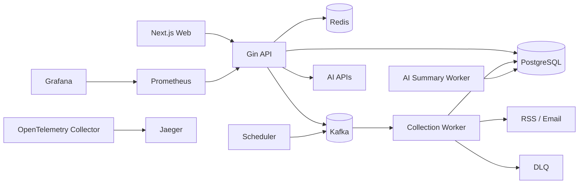

# contentflow

contentflow 是一个内容聚合系统：用户可以管理 RSS / Email 内容源，系统负责采集、去重、入库、查询、收藏、异步任务重试、DLQ 处理，并在文章之上扩展 AI 摘要、相似文章、Daily Digest 和 RAG 搜索。

## 技术栈

- 后端：Go、Gin、GORM、Viper、slog
- 数据：PostgreSQL、Redis、Kafka、golang-migrate
- 前端：React、Next.js、TypeScript、Tailwind CSS
- 可观测性：Prometheus、Grafana、OpenTelemetry、Jaeger
- 部署：Docker Compose、Kubernetes、Kustomize、GitHub Actions、GHCR
- 测试：Go test、gomock、testcontainers、Playwright、k6

## 系统架构



更多图和职责边界见 [docs/architecture.md](docs/architecture.md)。

## 核心功能

- 用户注册、登录、刷新令牌、登出。
- Source 管理，支持 RSS 和 Email 内容源。
- 手动采集、定时采集、Kafka 异步采集。
- Collection Run 查询，采集并发锁与 Redis 限流。
- Kafka outbox、重试、失败 DLQ、DLQ replay / handled。
- Article 查询、详情、已读、收藏、缓存。
- AI 摘要任务、embedding、相似文章、Daily Digest、RAG 搜索。
- Prometheus metrics、Grafana dashboard、OpenTelemetry tracing。
- Docker Compose 本地环境与 Kubernetes dev/staging/prod overlays。

## 本地快速启动

启动依赖和应用：

```fish
docker compose -f deployments/docker-compose.yaml up --build
```

常用地址：

- 后端 API：`http://localhost:8080`
- API 文档：`http://localhost:8080/docs`
- 前端：`http://localhost:3001`
- Grafana：`http://localhost:3000`
- Prometheus：`http://localhost:9090`
- Jaeger：`http://localhost:16686`

只启动基础依赖并在本机跑后端：

```fish
docker compose -f deployments/docker-compose.yaml up -d postgres redis kafka migrate
CONTENTFLOW_CONFIG=configs/config.yaml go run ./cmd/server
```

### 本地外部 AI

默认 AI provider 是 `local`，使用内置 extractive assistant，不需要外部密钥。本地开发要接真实 OpenAI-compatible API 时，在 `.env` 中设置：

```fish
API_KEY=<your-api-key>
base_url=https://api.openai.com/v1
model=<chat-model>
```

也可以使用正式环境变量 `CONTENTFLOW_AI_API_KEY`、`CONTENTFLOW_AI_BASE_URL`、`CONTENTFLOW_AI_MODEL`。有 API key 时后端会启用 OpenAI-compatible chat completions 和 embeddings；密钥只从本地环境读取，不会写入仓库。生产形态下 AI 设置应由用户在页面中管理，本地 `.env` 仅用于开发阶段。

用户在页面保存 AI API key 时，后端需要 `CONTENTFLOW_AI_SETTINGS_ENCRYPTION_KEY` 加密后入库。该值必须是 32 字节 base64 或 64 字符 hex；接口只返回 `has_api_key`，不会回显明文 key。

## 前端启动

```fish
cd web
npm install
set -x NEXT_PUBLIC_CONTENTFLOW_API_BASE_URL http://localhost:8080/api/v1
npm run dev
```

默认前端开发地址是 `http://localhost:3000`。Compose 中前端映射到 `http://localhost:3001`，避免和 Grafana 的 `3000` 冲突。

## API 文档

- OpenAPI 源文件：[api/openapi.yaml](api/openapi.yaml)
- 本地 Redoc：`http://localhost:8080/docs`
- 校验命令：

```fish
scripts/validate_openapi.sh
```

## 测试与 CI

本地聚合校验：

```fish
scripts/ci.sh all
scripts/ci.sh web-test
```

常用分项：

```fish
go test ./...
npm --prefix web run typecheck
npm --prefix web run lint
npm --prefix web run build
scripts/validate_k8s.sh
scripts/validate_ci.sh
```

后端已运行时，可以跑 API 冒烟测试：

```fish
scripts/ci.sh smoke-api
```

默认会创建一个临时用户和一个 `email` / `empty` source，验证健康检查、认证、source、采集、collection run、article 列表、RAG 搜索和 DLQ 列表接口。

CI 覆盖后端测试、覆盖率、OpenAPI、Kubernetes 渲染校验、前端 audit/typecheck/lint/test/build 和 Docker 镜像发布 workflow 校验。

## 部署方式

- 本地：`deployments/docker-compose.yaml`
- 后端镜像：`deployments/Dockerfile`
- 前端镜像：`web/Dockerfile`
- Kubernetes base：`deployments/k8s/base`
- Kubernetes overlays：`deployments/k8s/overlays/dev`、`staging`、`prod`
- 发布清单：[docs/releases/release-checklist.md](docs/releases/release-checklist.md)

Tag `v*` 会触发 `.github/workflows/release-images.yaml`，发布后端和前端镜像到 GHCR。

## 可观测性

- Metrics：`/metrics`
- Alert rules：`deployments/prometheus/rules/contentflow-alerts.yml`
- Grafana dashboards：`deployments/grafana/dashboards/`
- Tracing：OpenTelemetry Collector -> Jaeger
- 运行手册：[docs/runbooks/operations.md](docs/runbooks/operations.md)
- 排障记录：[docs/troubleshooting.md](docs/troubleshooting.md)

## 压测

k6 脚本：

```fish
BASE_URL=http://localhost:8080 ACCESS_TOKEN=<token> SOURCE_ID=1 ARTICLE_ID=1 k6 run scripts/load_articles.js
```

压测方法和结果模板见 [docs/performance/load-testing.md](docs/performance/load-testing.md)。
