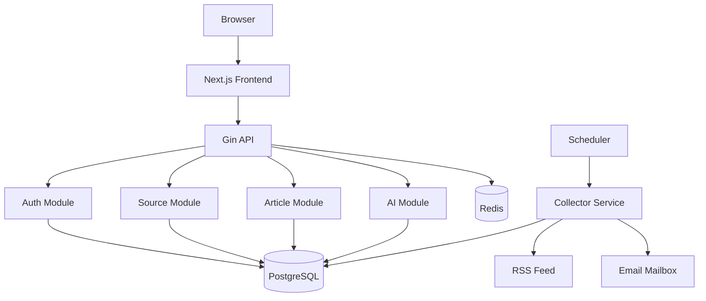
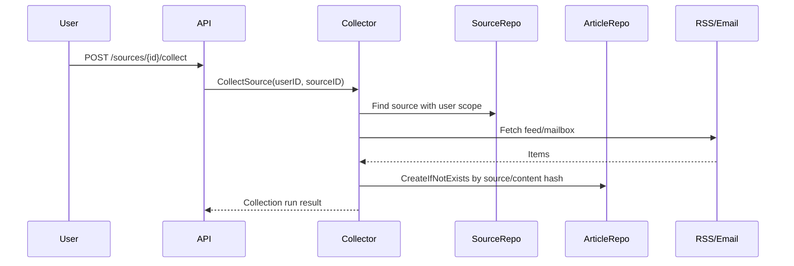
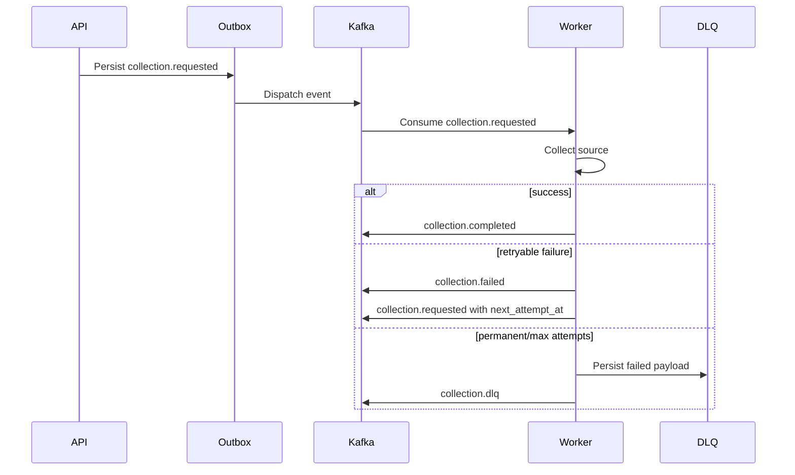
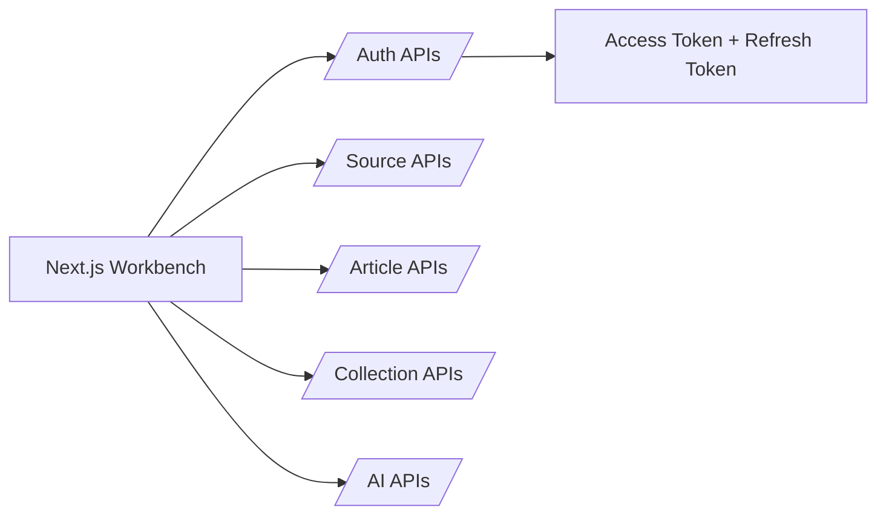
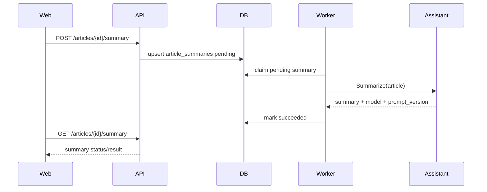
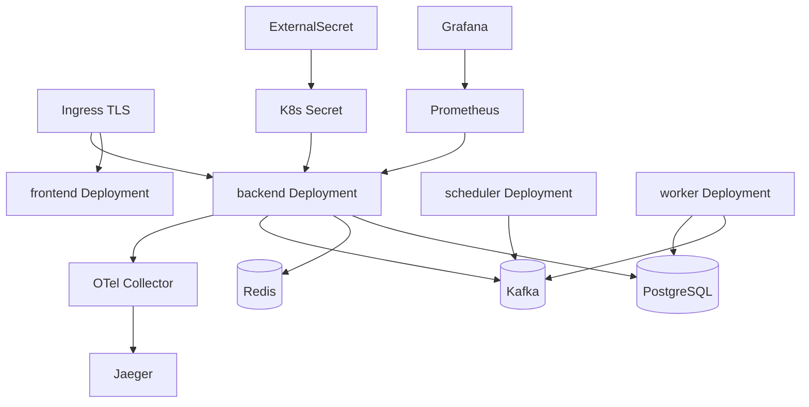

# Contentflow Architecture

## 职责边界

```text
cmd/server                 程序入口
internal/app               依赖组装、生命周期、后台 worker
internal/http              Router、middleware、统一响应
internal/module/auth       用户认证、JWT、Refresh Token
internal/module/source     内容源管理
internal/module/collector  RSS / Email 采集编排、collection run
internal/module/article    文章入库、查询、状态、缓存
internal/module/collectionjob Kafka 任务、outbox、retry、DLQ
internal/module/ai         摘要、embedding、Digest、RAG
internal/observability     metrics、tracing、GORM callbacks
deployments                Docker、Prometheus、Grafana、K8s
web                        Next.js 前端工作台
```

## 系统总览



## RSS / Email 采集数据流



## Kafka 异步任务流



## 前后端交互



## AI 任务流



AI 模块通过 `Assistant` 接口隔离模型提供方。当前默认实现是可预测的本地 extractive/hash 算法，便于测试和无外部密钥运行；后续可以替换成真实 LLM / embedding provider。

## 部署拓扑


